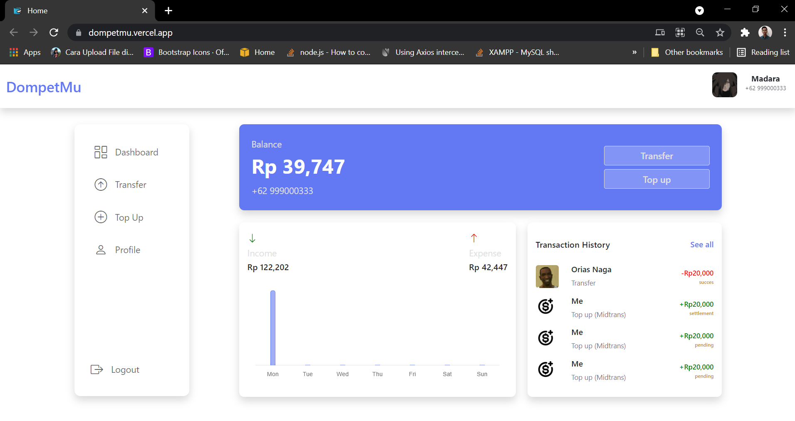

<h1 align='center'>Next JS - Dompet Mu Front-End</h1>
  <p align="center">
    <a href="https://dompetmu.vercel.app/">View Demo</a>
    ·
    <a href="https://github.com/Timotius-Nugroho/dompetMu-frontEnd/issues">Report Bug</a>
    ·
    <a href="https://github.com/Timotius-Nugroho/dompetMu-frontEnd/pulls">Request Feature</a>
  </p>



## About The Project

We bring you a mobile app for banking problems that oftenly wasting much of your times.

## Built With

[](https://nextjs.org/)
[](https://github.com/react-bootstrap/react-bootstrap)

## Requirements

1. <a href="https://nodejs.org/en/download/">Node Js</a>
2. Node_modules `npm install` or `yarn install`
3. Backend API : Dompet Mu - backEnd [`here`](https://github.com/Timotius-Nugroho/dompetMu-backEnd)

## Getting Started

1. Download this Project or you can type `git clone https://github.com/Timotius-Nugroho/dompetMu-frontEnd`
2. Open app's directory in CMD or Terminal
3. Type `npm install` or `yarn install`
4. Add env config at next.config.js

```sh
APP_NAME: [your app name]
NEXT_PUBLIC_BACKEND_URL: [your backend API url]
IMG_BACKEND_URL: [for calling image from API]
```

5. Type `npm run dev`

## Acknowledgements

- [Axios](https://www.npmjs.com/package/axios)
- [Redux](https://redux.js.org/)
- [React](https://reactjs.org/)
- [React Bootstrap](https://react-bootstrap.github.io/)
- [Chart Js](https://www.chartjs.org)
- [Next Cookie](https://www.npmjs.com/package/next-cookie)
- [Js Cookie](https://www.npmjs.com/package/js-cookie)

## License

© [Timotius Nugroho](https://github.com/Timotius-Nugroho/)
